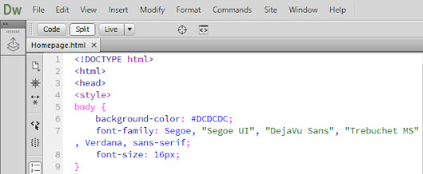

<!DOCTYPE html>
<html>
<head>

</head>
<body>

<h1>How To Program In HTML?</h1>

    

<ul><a class="nav" href="1 Homepage.html">Home</a></ul>
<ul><a class="nav" href="2 Tutorials Page.html">Tutorials</a></ul>
<ul><a class="nav" href="3 Basic HTML Tags.html">Basic HTML Tags List</a></ul>

 
 
 

	<button class="styled" onclick="goBack()">Go Back</button>

Programming is a good way to train your brain. It is helpful because it makes your brain think. Learning programming is becoming a necessity and it can help you land a good job in the future.

The HTML language stands for Hypertext Markup Language, and it gives a foundation to your website. HTML is widely used to create professional looking websites.

HTML describes the structure and design of a Web page. HTML consists of a series of elements. HTML elements tell the browser how to display the content. HTML elements are represented by tags. Tags display different sections of a website. Browsers do not display the HTML tags, but use them to style the content of the web page.

<h2><b>Introduction</b></h2>

The first tag in a HTML line of code is called the opening tag and the second tag is often referred to as the closing tag. The closing tag is just the normal tag with a <b>forward slash (/)</b> in it.

For Example:
The opening tag for creating a paragraph is <b class="tags">&lt;p&gt;</b> and it's closing tag is <b class="tags">&lt;/p&gt;</b>.

<h2>Things You Must Do:</h2>

 <strong>ALWAYS</strong> start your HTML programming page with the <b class="tags"> &lt;DOCTYPE html&gt; </b> declaration. This determines what type of document you are using. This declaration helps browsers display you webpage correctly. This command should also only appear once through your code, and it should always be located at the very top.

    
 
You should follow this up with a <b class="tags">&lt;html&gt;</b>, and a <b class="tags">&lt;head&gt;</b> command only if you want to style your webpage.

   

 As you can see above, I started the page with the <b class="tags"> &lt;DOCTYPE html&gt; </b> command.

<h4>How to Execute HTML Programs</h4>

You can use several programs to run or code in HTML. One of the most popular ones is Adobe Dreamweaver, it is not free, but there are alternatives. You can use the built in NotePad application on many Windows OS (operating software) computers. You just type in the code and save it as an HTML file. Then click View in Browser. That should give you a preview of what your have done so far.

</body>
</html>

